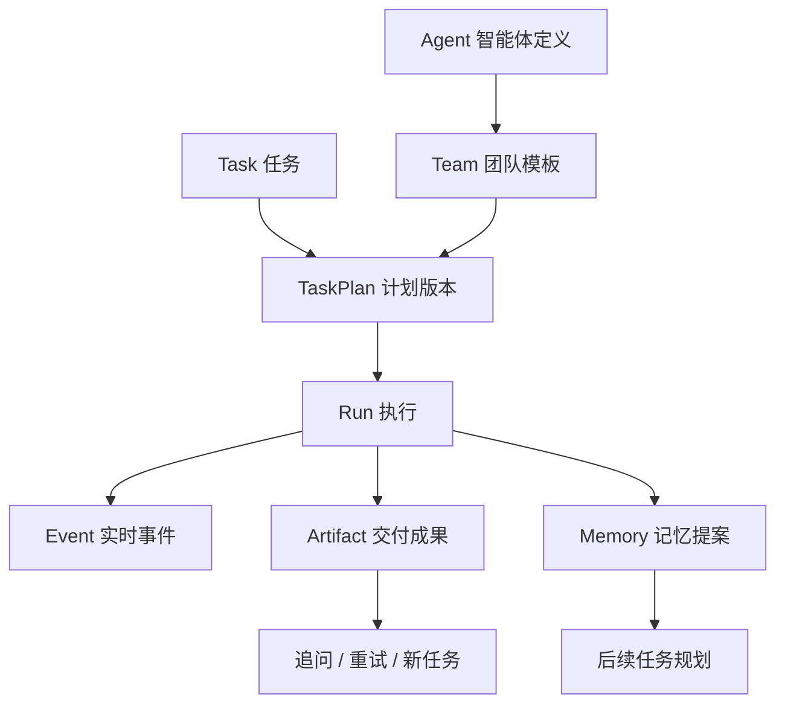
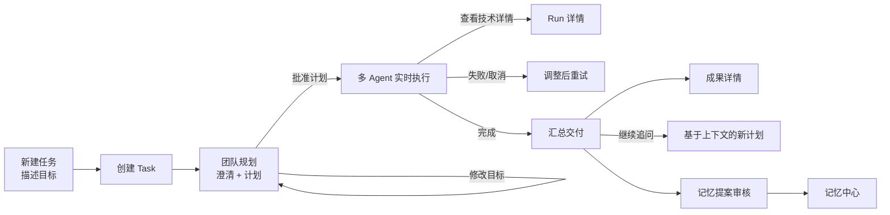

# ULOO 全界面蓝图与渐进实施规范

> 版本：1.0  
> 冻结日期：2026-09-24  
> 适用范围：Dify 源码内的 ULOO Web、Console BFF、ULOO Core 及 Studio 集成  
> 产品主线：**任务入口 → 团队规划 → 多 Agent 实时执行 → 汇总交付**

## 1. 为什么要先冻结这份蓝图

ULOO 不是一组互不相关的管理页。它首先是一个“把复杂任务交给多智能体团队，并看着它完成”的工作产品。现有页面的问题不是单个页面不够漂亮，而是：

- 任务、运行、记忆、Agent、Team 被平铺在同一层，用户不知道从哪里开始。
- 页面之间缺少共同的主对象和上下文，进入 Run 后看不到来自哪个任务，进入 Memory 后也找不到来源。
- 正式页与预览页部分链接混用，出现“看起来能点、实际跳到另一套页面”的割裂。
- 未实现模块使用通用占位卡片，无法表达未来页面结构，也无法作为后续验收标准。
- 任务不同阶段各自堆控件，缺少稳定的状态流和固定主操作。

本文件从现在起是 ULOO 前端的界面单一事实源。后续实现、评审和验收都按本文件执行；旧提示词中与本文件冲突的页面设计，以本文件为准。

## 2. 产品心智模型

### 2.1 唯一主对象

用户首先创建的是 **Task（任务）**。其他对象都是任务的组成或支撑：



用户不需要先理解 Agent、Run、SSE 等技术概念。第一次进入产品，只需要描述目标；系统再推荐团队、生成计划并请求确认。

### 2.2 三层信息架构

| 层级 | 用户问题 | 页面 |
|---|---|---|
| 工作 | 我要做什么、做到哪一步了？ | 新建任务、全部任务、任务工作台 |
| 运行与资产 | 具体怎么执行、产出了什么、记住了什么？ | 运行记录、运行详情、交付成果、记忆中心 |
| 资源配置 | 谁来做、团队如何协同？ | 团队、智能体、运行环境 |

Studio 不是第四套管理系统。它是 Dify 工作流调用 ULOO Team 的集成入口，只提供接入说明、节点状态和跳转。

## 3. 全局导航与页面框架

### 3.1 推荐框架

ULOO 保留在 Dify 原有登录、workspace、主题和权限框架内。进入 ULOO 后增加一条常驻的二级左侧栏，不再把所有模块挤在顶部横向导航中。

```text
┌──────────────── Dify 原有顶栏 / workspace ────────────────┐
│ ULOO 驭龙       全局搜索        运行环境状态       帮助       │
├──────────────┬────────────────────────────────────────────┤
│ 工作          │ 页面标题 / 面包屑                  主操作   │
│  + 新建任务   │                                            │
│  全部任务     │ 当前页面内容                               │
│              │                                            │
│ 运行与资产    │                                            │
│  运行记录     │                                            │
│  交付成果     │                                            │
│  记忆中心     │                                            │
│              │                                            │
│ 资源配置      │                                            │
│  团队         │                                            │
│  智能体       │                                            │
│              │                                            │
│ 集成          │                                            │
│  Studio 节点  │                                            │
└──────────────┴────────────────────────────────────────────┘
```

窄屏时左侧栏折叠为抽屉；任务工作台右侧上下文栏折叠为可打开的面板。所有页面共用：

- 品牌标识、workspace 上下文和当前环境状态。
- 面包屑、页面标题、简短说明、唯一的主操作。
- 一致的 loading、empty、error、permission、offline 状态。
- request ID / trace ID 的可复制错误详情。

### 3.2 导航命名原则

- 面向用户写“智能体”，代码与接口保留 `agent`。
- 面向用户写“运行记录”，代码与接口保留 `run`。
- “团队”表示可复用配置；“本次执行团队”表示计划里的快照。
- “交付成果”表示可阅读、下载、继续处理的 Artifact，不叫“输出日志”。
- 不在主导航展示“事件流”“SSE”“Agno”等实现术语。

## 4. 规范路由

### 4.1 正式路由

| 路由 | 页面 | 说明 |
|---|---|---|
| `/uloo` | 新建任务 | 默认入口，不再兼任统计大屏 |
| `/uloo/tasks` | 全部任务 | 任务检索、筛选、继续处理 |
| `/uloo/tasks/{task_id}` | 任务工作台 | 同一 URL 承载规划、审批、执行、交付四阶段 |
| `/uloo/runs` | 运行记录 | 跨任务的运行检索与故障入口 |
| `/uloo/runs/{run_id}` | 运行详情 | 事件、成员、用量、错误、重连状态 |
| `/uloo/artifacts` | 交付成果 | 跨任务成果库 |
| `/uloo/artifacts/{artifact_id}` | 成果详情 | 内容、版本、来源、下载与继续任务 |
| `/uloo/memory` | 记忆中心 | 已生效记忆与待审核提案 |
| `/uloo/memory/{memory_id}` | 记忆详情 | 内容、作用域、来源、版本和撤销 |
| `/uloo/resources/teams` | 团队列表 | 可复用团队模板 |
| `/uloo/resources/teams/{team_id}` | 团队详情 | 成员、模式、限制、验证和试运行 |
| `/uloo/resources/agents` | 智能体列表 | Agent 定义与状态 |
| `/uloo/resources/agents/{agent_id}` | 智能体详情 | 配置、工具、知识、验证和对话调试 |
| `/uloo/runtime` | 运行环境 | 模型、Core、Agno、SSE、数据库的只读就绪状态 |
| `/uloo/integrations/studio` | Studio 节点 | 插件安装状态、使用说明和示例 |

旧的 `/uloo/agents`、`/uloo/teams` 只做永久重定向，不再承载独立实现。页面内不得写死这些旧地址。

### 4.2 预览路由

`/uloo-preview/**` 与正式路由保持同构，使用相同 Shell 和页面组件，只替换数据适配器：

- 所有演示数据必须显示“演示数据”标识。
- 预览页内链接始终停留在 `/uloo-preview/**`。
- 正式页禁止在接口失败时自动回退到演示数据。
- 页面结构、状态和交互在两套入口保持一致，避免维护两份 UI。

## 5. 主流程与页面连续性



连续性硬规则：

1. Task ID 从创建开始贯穿所有页面；Run、Artifact、Memory 都能一键回到来源 Task。
2. 任务生命周期不切换多个顶级页面，始终留在 `/tasks/{task_id}` 工作台。
3. 工作台顶部阶段条固定为：`团队规划 → 等待确认 → 实时执行 → 汇总交付`。
4. 每个阶段只能有一个视觉主按钮；次要操作进入更多菜单或次级按钮。
5. 任何技术详情都通过抽屉或 Run 详情下钻，不打断主任务叙事。

## 6. 全页面规格

以下页面编号也是实施与验收编号。

### UI-01 全局 Shell

**用户目标**：任何时刻都知道自己在哪、下一步去哪、系统是否可执行。

**布局**：Dify 顶栏 + ULOO 左侧栏 + 页面标题区 + 内容区。左侧栏底部显示简化运行状态：可用、配置缺失或故障。

**关键交互**：

- “新建任务”始终置顶。
- 活动导航按规范路由高亮，详情页高亮其父级导航。
- 状态指示器打开运行环境页，不在每页重复大块健康卡片。
- 路由切换保留任务筛选和列表滚动位置。

**当前状态**：已有横向 Shell，需重构；Logo 已有素材。  
**依赖**：`GET /console/api/uloo/health/ready`、`GET /console/api/uloo/capabilities`。

### UI-02 新建任务

**用户目标**：不用预先配置流程，用自然语言发起工作。

**布局**：居中的大输入区，附目标示例、可选约束、附件入口；下方仅显示最近任务，不放虚假 KPI。

**主操作**：`开始规划`。

**行为**：

- 提交后立即创建 Task，按钮进入确定性 loading。
- 创建成功直接进入任务工作台的“团队规划”阶段。
- 配置缺失时保留输入，给出“查看运行环境”入口。
- 高级项折叠：指定团队、截止时间、预算、允许的工具。

**当前状态**：已有入口与创建/规划调用，需按统一 Shell 和状态规范整理。  
**依赖**：`POST /tasks`、`POST /tasks/{id}/plans`。

### UI-03 全部任务

**用户目标**：找到未完成任务，快速继续处理。

**布局**：搜索与状态筛选 + 任务表格/卡片；默认按最近更新排序。

**核心字段**：标题、当前阶段、采用团队、最近运行、更新时间、待处理动作。

**主操作**：`新建任务`。行点击进入任务工作台；“等待确认”“执行失败”显示明确待办。

**空状态**：解释 ULOO 的四阶段流程并提供新建任务按钮。  
**当前状态**：已有列表，但预览/正式链接存在硬编码风险，需统一路由适配器。  
**依赖**：`GET /tasks?q=&status=&offset=&limit=`。

### UI-04 任务工作台

这是产品最重要的页面，同一页面根据 Task 状态切换中心内容。

**固定区域**：

- 顶部：面包屑、任务标题、状态、更新时间、更多操作。
- 阶段条：团队规划、等待确认、实时执行、汇总交付。
- 左栏：目标、约束、计划版本与步骤导航。
- 中栏：当前阶段的主要内容。
- 右栏：本次团队、上下文来源、预算/用量、相关对象。

#### UI-04A 团队规划

- 展示 Planner 推荐的 Team、选择依据、假设、步骤、每步 Agent 和预期产物。
- Planner 需要澄清时显示对话式问题，用户回答后生成新计划版本。
- 可更换 Team、编辑目标或重新规划；历史计划版本可查看但不可覆盖。
- 主操作：`确认这份计划`。

#### UI-04B 等待确认

- 聚焦展示计划摘要、风险、预计预算/时长和相对上一版本的变化。
- 验证失败按字段定位到步骤或资源，不允许启动。
- 主操作：`批准并开始执行`；次操作：`返回调整`。

#### UI-04C 实时执行

- 左侧步骤同步标记 queued/running/succeeded/failed/skipped。
- 中间是面向人的实时进度流：谁在做什么、产生了什么结论、是否需要输入。
- 右侧展示成员状态、总用量、已用时间和连接状态。
- 页面刷新或断线后从最后事件序号恢复；不得把 SSE 断线误显示为 Run 失败。
- 主操作：运行中为 `取消执行`；需要用户输入时为 `提交补充信息`。

#### UI-04D 汇总交付

- 首屏展示最终答案或报告，不先展示日志。
- 交付成果按类型呈现：文档、结构化数据、文件、链接。
- 展示引用来源、关键假设、未解决事项与各 Agent 贡献摘要。
- 主操作：`继续追问`；次操作：下载、复制、创建后续任务、查看运行详情。
- 若产生记忆提案，在交付底部显示可审核卡片，不自动把所有输出写入长期记忆。

**当前状态**：预览工作台已有四阶段演示；正式工作台已有真实计划展示，但真实 Team Run/SSE/Artifact 尚未实现。  
**依赖**：Task/Plan 接口、Run 创建/详情/SSE、Artifact、Memory Proposal。

### UI-05 运行记录

**用户目标**：跨任务排查失败、查看正在运行的任务和成本。

**布局**：状态筛选、时间范围、Team/Agent 筛选 + 运行表格。

**核心字段**：Run ID、来源任务、Team、状态、开始/耗时、用量、错误摘要。

**主操作**：无强制创建按钮；Run 必须从 Task 或 Studio 发起。  
**当前状态**：占位。  
**依赖**：`GET /runs`。

### UI-06 运行详情

**用户目标**：回答“执行到哪里、谁失败了、能否恢复”。

**布局**：运行摘要 + 步骤/成员拓扑 + 可筛选事件时间线 + 输入输出/用量标签页。

**关键能力**：

- 显示 Task、计划版本、Team/Agent 配置快照。
- 时间线按 sequence 稳定排序，可按成员、事件类型、错误筛选。
- 正在运行时接入 SSE；历史事件与实时事件无缝衔接。
- 失败事件显示稳定错误码、request/trace ID 和安全摘要。
- 允许取消；允许从原 Task 调整后重试，不提供无上下文的“盲重跑”。

**当前状态**：未开始。  
**依赖**：`GET /runs/{id}`、`GET /runs/{id}/events`、`GET /runs/{id}/stream`、`POST /runs/{id}/cancel`。

### UI-07 交付成果库

**用户目标**：跨任务找到已经完成的报告、文件和结构化结果。

**布局**：类型/任务/时间筛选 + 成果卡片或表格。

**核心字段**：标题、类型、来源任务、生成时间、版本、可下载状态。  
**当前状态**：尚无路由和数据模型。  
**依赖**：`GET /artifacts`。

### UI-08 成果详情

**用户目标**：阅读、下载、追溯并继续使用成果。

**布局**：可阅读内容区 + 元数据侧栏 + 来源/版本标签页。

**关键操作**：下载、复制、回到任务、查看 Run、基于成果继续追问或创建新任务。  
**当前状态**：未开始。  
**依赖**：`GET /artifacts/{id}`、文件下载接口。

### UI-09 记忆中心

**用户目标**：知道系统记住了什么、为什么记住、影响哪些任务。

**布局**：顶部切换 `已生效` / `待审核`；支持 scope、Agent、Team、来源筛选。

**核心字段**：摘要、scope、来源任务/Run、适用对象、版本、创建者、更新时间。

**主操作**：待审核页为批量审核；已生效页不鼓励随意新增，记忆主要由运行产生提案。  
**当前状态**：占位。  
**依赖**：`GET /memories`、`GET /memory-proposals`、批准/拒绝接口。

### UI-10 记忆详情

**用户目标**：审计一条记忆的来源和影响，并能修订或撤销。

**布局**：内容与版本历史 + 来源证据 + 作用域/消费者侧栏。

**关键操作**：批准、拒绝、修订、停用；每次变更保留版本。  
**当前状态**：未开始。  
**依赖**：Memory detail/version/proposal 接口。

### UI-11 团队列表

**用户目标**：管理可被 Planner 和 Studio 复用的多智能体团队。

**布局**：搜索、状态、mode 筛选 + 团队卡片/表格。

**核心字段**：名称、mode、Leader、成员数、默认模型、最近验证、启用状态。

**主操作**：`新建团队`。  
**当前状态**：占位；Core 已有 Team CRUD。  
**依赖**：Team CRUD/validate。

### UI-12 团队详情与编辑

**用户目标**：明确团队成员如何协作，并在保存前验证可运行。

**布局**：基本信息、协作模式、成员与 Leader、Instructions、Memory Policy、Limits；右侧固定验证结果。

**关键规则**：

- 成员只能选择当前 workspace 已启用 Agent。
- `coordinate` / `route` 必须选择 Leader，`collaborate` 不强制。
- 保存使用 version 乐观锁；冲突时显示字段差异。
- 提供“小任务试运行”，结果明确标识为测试运行。

**当前状态**：后端 CRUD/validate/factory 已有，Web 未实现。  
**依赖**：Team CRUD/validate、Team test run（可在正式 Run 接口完成后开放）。

### UI-13 智能体列表

**用户目标**：查看和管理团队可用的角色能力。

**布局**：搜索、状态、模型筛选 + 列表；显示被哪些 Team 使用。

**主操作**：`新建智能体`。  
**当前状态**：已实现 CRUD 页面，需接入新 Shell、详情路由和引用关系。  
**依赖**：Agent CRUD。

### UI-14 智能体详情、编辑与对话调试

**用户目标**：配置一个角色，并用真实模型确认它能正常回答。

**布局**：左侧配置表单，右侧持续可见的“对话调试”面板；移动端切换标签页。

**配置**：名称、角色、instructions、model ref、工具、知识引用、限制、启用状态。

**调试**：

- 发送测试消息调用真实 Agent test-run。
- 显示 runtime、model、usage、run/trace ID 和明确错误。
- 保存前可 validate；未保存草稿是否可调试必须有清晰提示。
- 不在浏览器展示或保存 API Key。

**当前状态**：已有列表、表单和调试组件，需统一为详情页结构并补模型/工具/知识的服务端引用选择。  
**依赖**：Agent CRUD/validate/test-runs、资源引用列表。

### UI-15 运行环境

**用户目标**：快速判断为什么不能执行，以及应该去哪里配置。

**布局**：只读检查清单：ULOO Core、数据库、Agno、模型 Provider、Streaming、Memory、Studio Plugin。

**原则**：

- 只显示真实 capabilities；未实现功能明确为“尚未提供”，不能显示绿色。
- 模型密钥仍由服务端/Dify 设置管理，本页只显示引用、连通性和跳转。
- 每项失败给出安全、可操作的修复方向和 trace ID。

**当前状态**：健康信息散落在入口页，需集中。  
**依赖**：health、capabilities、provider validation。

### UI-16 Studio 节点集成

**用户目标**：在 Dify Studio 中使用 `ULOO / Agno Team` 节点。

**布局**：安装/连接状态、三步接入说明、可用 Team 列表、输入输出契约、打开 Studio 按钮。

**原则**：不在这里复制工作流画布；真正编辑在 Dify Studio 完成。  
**当前状态**：未开始。  
**依赖**：Dify Agent Strategy 插件和 capabilities。

## 7. 全局状态规范

每个取数页面必须显式实现下列状态，禁止用一个旋转图标覆盖所有情况：

| 状态 | 显示要求 | 可执行动作 |
|---|---|---|
| 首次加载 | 与最终布局一致的 skeleton | 无 |
| 空数据 | 解释该对象是什么以及如何产生 | 唯一主操作 |
| 请求失败 | 人类可读说明 + error code + request/trace ID | 重试、复制详情 |
| 未配置 | 指明缺少模型/服务/插件 | 前往运行环境或 Dify 设置 |
| 无权限 | 说明所需权限，不伪装成 404 | 返回上级 |
| 离线/SSE 断开 | 保留已有内容，显示重连状态 | 手动重连 |
| 版本冲突 | 显示服务端新版本及差异 | 刷新合并、放弃本地修改 |
| 删除确认 | 明确引用关系和软删除影响 | 确认/取消 |

正式页绝不因为错误而展示演示结果。预览页必须固定、可复现，并始终标识演示身份。

## 8. 页面间引用与跳转

| 当前对象 | 必须能到达 |
|---|---|
| Task | Plan 版本、当前/历史 Run、Artifacts、采用的 Team |
| Run | 来源 Task、计划版本、Team/Agent 快照、Events、Artifacts |
| Artifact | 来源 Task/Run、引用来源、基于它发起后续任务 |
| Memory | 来源 Task/Run/Artifact、作用的 Agent/Team |
| Team | 成员 Agent、使用该 Team 的 Tasks/Runs |
| Agent | 所属 Teams、参与的 Runs、产生/使用的 Memory |

列表筛选通过 URL query 表达，返回上级后恢复筛选。详情页中的对象名称都应可点击，禁止只显示不可追溯的 UUID。

## 9. 前端组件边界

为防止正式版和预览版继续分叉，页面组件按以下层次组织：

```text
features/uloo/
  shell/                 # 导航、标题区、环境状态
  task-entry/            # 新建任务
  task-list/             # 任务列表
  task-workbench/        # 四阶段统一工作台
  run-list/ run-detail/
  artifact-list/ artifact-detail/
  memory-list/ memory-detail/
  team-list/ team-detail/
  agent-list/ agent-detail/
  runtime/
  studio-integration/
  shared/                # 状态页、错误详情、对象链接、状态标签
  data/
    formal-adapter.ts    # 只调用 /console/api/uloo/**
    preview-adapter.ts   # 固定演示场景
    route-context.ts     # /uloo 与 /uloo-preview 链接生成
```

页面不得根据 `preview` 到处拼接字符串；统一使用 route context。业务组件不得直接 import 演示数据。

## 10. 接口与页面对照

| 界面 | 最小接口集合 | 后端现状 |
|---|---|---|
| 新建任务/任务列表 | `POST/GET /tasks` | 已有 |
| 规划/确认 | `POST /tasks/{id}/plans`、计划确认接口 | 部分已有，确认契约需统一 |
| 实时执行 | Run create/detail/events/stream/cancel | 未完成 |
| 交付成果 | Artifact list/detail/download | 未完成 |
| 记忆中心 | Memory/Proposal CRUD 与审核 | 未完成 |
| 团队 | Team CRUD/validate | Core 已有，Web 未完成 |
| 智能体 | Agent CRUD/validate/test-runs | 已有，Web 基本可用 |
| 运行环境 | health/capabilities/provider validate | 部分已有 |
| Studio 集成 | 插件状态、Team 运行接口 | 未完成 |

界面可以先有结构，但凡依赖接口未完成，必须显示准确的不可用状态；不得制造成功结果假装功能已完成。

## 11. 渐进实施顺序

### Phase UI-0：统一外壳和路由

**实施**：重构左侧二级导航；增加页面标题组件、route context、通用状态组件；补齐规范路由与旧路由重定向；修复预览链接越界。

**用户可见效果**：所有页面像同一个产品；无论从正式版还是预览版进入，都不会跳到另一套路径。

**验收**：桌面/窄屏导航通过；活动态准确；刷新后路由不丢；所有未实现页使用对应页面骨架和准确状态，不再使用通用占位卡。

### Phase UI-1：打磨唯一主流程

**实施**：新建任务、任务列表、任务工作台四状态统一；固定主操作；补返回与对象链接；正式和预览复用组件。

**用户可见效果**：用户第一次进入即可理解并完整体验“描述目标 → 看计划 → 批准 → 看执行 → 收成果”。正式环境未接 Run 时在批准处准确阻断。

**验收**：每个 Task 状态都有确定页面；后退/刷新不丢上下文；无死按钮；预览四阶段可重复演示。

### Phase UI-2：完成团队与智能体配置

**实施**：Teams 列表/详情/验证；Agents 迁移到详情页结构；补对话调试框、引用关系和冲突处理。

**用户可见效果**：用户能先试 Agent，再组成 Team，并能在新任务规划中选择该 Team。

**验收**：真实 CRUD、刷新不丢、校验清晰、浏览器无密钥、无第二套 Workflow Canvas。

### Phase UI-3：接入真实 Run/Event/SSE

**实施**：先完成后端 Run/Event 接口，再实现运行列表、详情和任务工作台实时状态；断线补发和取消。

**用户可见效果**：批准计划后真实 Agno Team 执行；多个 Agent 的进度、结果和错误实时可见。

**验收**：真实模型、`runtime_type=agno`、`is_mock=false`；刷新/断线事件不丢；失败可追溯。

### Phase UI-4：完成交付成果

**实施**：Artifact 数据模型、列表、详情、下载、版本与来源；任务工作台交付阶段接入。

**用户可见效果**：执行结束先得到可阅读的成果，并能下载、追问、追溯来源。

**验收**：Artifact 与 Task/Run 双向可达；失败运行不制造成功成果。

### Phase UI-5：完成跨 Agent 记忆

**实施**：Memory/Proposal/version 接口；审核、作用域、来源证据和撤销；规划时注入可审计摘要。

**用户可见效果**：用户能控制“系统记住什么”，后续 Agent 可共享经批准的上下文。

**验收**：workspace 严格隔离；每条记忆有来源和版本；敏感信息可拒绝/删除；不存隐藏思维链。

### Phase UI-6：接入 Studio 节点

**实施**：Dify Agent Strategy 插件、集成状态页、节点输入输出、blocking/streaming E2E。

**用户可见效果**：用户在 Dify Studio 选择 `ULOO / Agno Team`，选 Team 后即可把多 Agent 能力嵌入工作流。

**验收**：保存、重开、发布、导出/导入参数不丢；不要求 curl 或改数据库。

## 12. 每阶段统一完成定义

一个界面只有同时满足以下条件才能标为完成：

- 路由、导航、面包屑和对象回链完整。
- loading、empty、error、未配置、权限和窄屏状态完整。
- 正式页使用真实接口，预览页明确标识演示数据。
- 请求有错误码及 request/trace ID，敏感信息不进入浏览器。
- 至少包含组件测试；关键流程包含浏览器 E2E。
- 刷新后状态可恢复，不依赖组件内临时假数据。
- `capabilities` 与界面按钮一致，未实现功能不显示成可用。
- 文档和 `TODO.md` 同步更新，并通过阶段验收门。

## 13. 明确不做

- 不另建用户、组织、登录或权限系统，复用 Dify workspace。
- 不复制 Dify Workflow Canvas；ULOO 只提供 Team 配置和 Studio 节点。
- 不为任务四阶段拆四套互不关联的详情页。
- 不用假 KPI、假 Run、假记忆填充正式环境。
- 不把 Agent 的逐字思维链保存或展示为“可观测性”。
- 不让浏览器直连 8200，也不向浏览器返回服务令牌或模型密钥。
- 不继续增加无入口、无回链、无状态规范的孤立页面。

## 14. 当前基线判断

按本蓝图评估，当前已具备：新建任务、任务列表、任务规划、任务工作台预览、Agent CRUD/调试的部分能力。尚未形成连续产品的关键原因是 Shell/路由未统一，Teams 未落地，且真实 Team Run、Event/SSE、Artifact、Memory 和 Studio 节点仍缺失。

下一步只执行 **Phase UI-0**；通过后再进入 **Phase UI-1**。这两个阶段完成前，不继续新增孤立功能页面。
